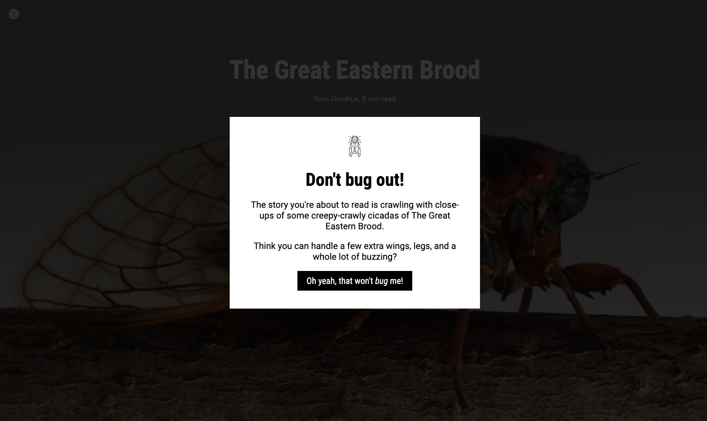

# Splash screen

You may want to greet readers or preface the story they're about to read. A splash screen can perform this role and sit atop your story until dismissed.

## Live sample

[](https://storymaps.esri.com/stories/storymaps-script-embed-examples/splash-page/)*[Click to see the live example](https://storymaps.esri.com/stories/storymaps-script-embed-examples/splash-page/)*


## Usage instructions

Implementing a splash screen involves:
- Creating a `<div class="splash-overlay">` in the HTML page that obscures the main content of the page.
- Creating a `<div class="splash-screen">` in the HTML page that contains the text and button that will greet your readers.
- Define a `closeSplashScreen()` function in the HTML page, called by the button that hides the `.splash-overlay`.
- Define the appearance of the `.splash-overlay` and `.splash-screen` classes in the CSS file.
- Prevent the main content of the page from scrolling until **the splash screen is dismissed** by adding `overflow: hidden` to the CSS of the `<body class="no-scroll">`.

### HTML snippets

**Prevent the story from scrolling**: This prevents the story from scrolling when the splash screen is active.
```html
<!-- Prevent the story from scrolling-->
<body class="no-scroll">
```

**Splash screen and overlay**: These elements make up the `splash screen` that contains the greeting and a `splash-overlay` that obscures the story underneath.
```html
<!-- Splash overlay -->
<div class="splash-overlay" id="splashOverlay">
  <!-- Splash screen -->
  <div class="splash-screen">
    
    <h1>Don't bug out!</h1>
    <p>The story you're about to read is crawling with close-ups of some creepy-crawly cicadas of The Great Eastern Brood.</p>
    <p>Think you can handle a few extra wings, legs, and a whole lot of buzzing?</p>
    <button onclick="closeSplashScreen()">Oh yeah, that won't <i>bug</i> me!</button>
  </div>
</div>
```

**Dismissing the splash screen**: This defines a `closeSplashScreen()` function that is called by the button within the `<div class="splash-screen">` that:
- Hides the `<div class="splash-screen">` and all of its contents by setting `display = 'none'`.
- Enables scrolling by removing the `no-scroll` class from the `<body>`.
```html
  <script>
    // Function to close the splash screen and reveal the story
    function closeSplashScreen() {
      // Hide the splash screen
      document.getElementById('splashOverlay').style.display = 'none';

      // Enable scrolling on the main page
      document.body.classList.remove('no-scroll');
    }
  </script>
```

### CSS customizations

Aside from the styling of the `splash-overlay` and `splash-screen` elements, the most important part of the CSS is preventing the story from scrolling while the splash screen is active.

This is achieved using the `.no-scroll` class and setting the `overflow: hidden`.
```css
body.no-scroll {
  overflow: hidden; /* Prevent the story scrolling while splash screen in place */
  background-color: #a25d35; /* Background color while the embedded story loads */
}
```